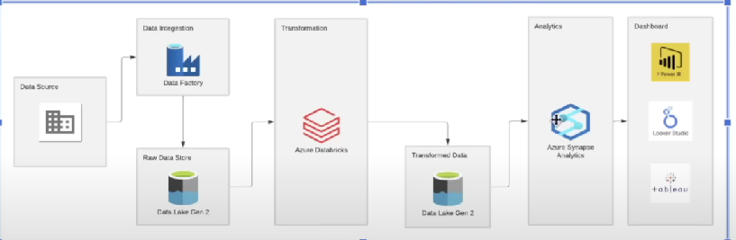
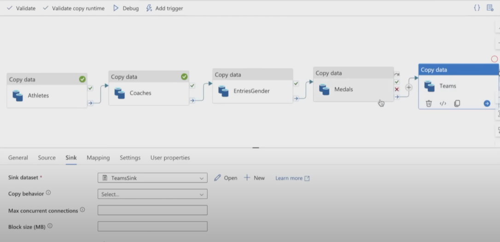
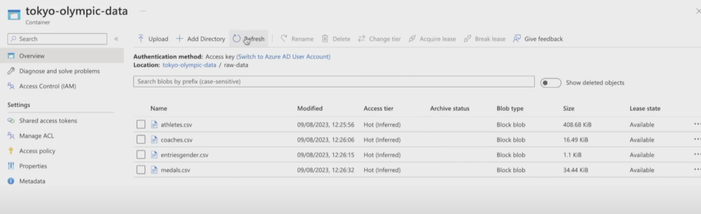
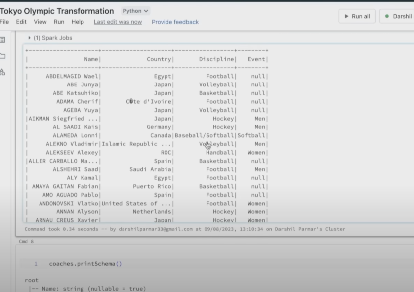
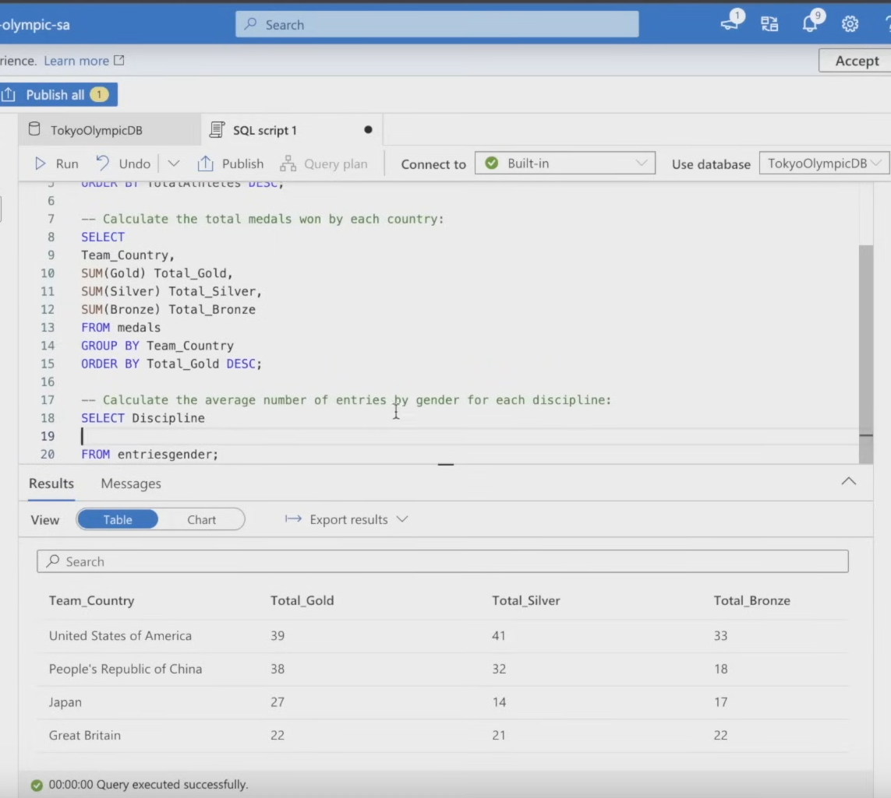

# tokyo-olympic-azure-data-engineering-project

## Project Descrtiption:
In this project, I built a project that runs in Azure Cloud Service and perform the ETL process of Olympic Data dataset from kaggle.

## 1. Extraction

Create a workflow automation in Azure DataFactory to extract the data from kaggle and store in Data Lake Gen2 container automatically.

There are 5 CSV datasets:
  - Athletes
  - Coaches
  - EntriesGender
  - Medals
  - Teams

## 2. Transformation

Deploy Databrick and utilize Pyspark to implement some basic data transformations such as formating datatype, sorting and cleaning. Then performing neccesary aggregations.

After finishing transformation tasks, I restored transformed data onto Data Lake Gen2.

## 3. Loading

Using Azure Synapse Analytics to ingests transfomred data from Data Lake Gen2. Then Writing query to find insights of the data in Azure Synapase Lake database.

# 4. Visualization

After gathering all analyzed data, I created dashboard that visualize the insights in PowerBI
